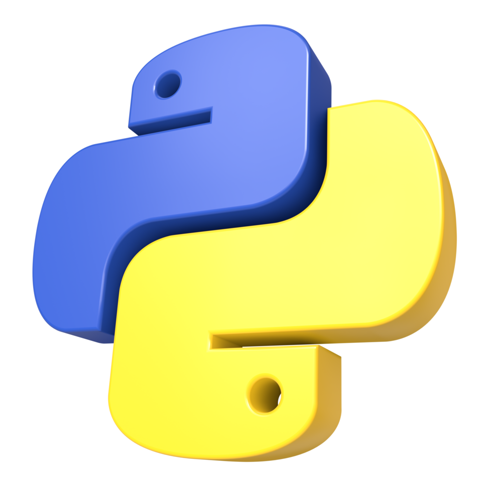

#  Python Introduction

Python is a general purpose programming language used across all industries. Many well known industries have been developed with the use of Python. It is increasingly popular due to its readability and beginner friendliness; it has overtaken Javascript as the top coding language.

## Table of Contents
- [ Python Introduction](#-python-introduction)
  - [Table of Contents](#table-of-contents)
    - [The Computer Recipe:](#the-computer-recipe)
  - [I. Strings](#i-strings)
  - [Loops](#loops)
  - [Functions](#functions)
  - [Glossary](#glossary)

### The Computer Recipe:
Programming is a set of instructions so that the computer can run functions.\
Algorithms are step-by-step rules to solve a problem.\
The computer has two states: On and Off. Binary code represents the two modes.\
Coding is an interatve process: Code, test, debug.

## I. Strings

## Loops
Control structures that loops back to repeat a block of codes

## Functions
Designed to be reusable code, performs only one task \
Types of functions:
1. Built-in functions: abs(), print(), float(), tuple(), list() \
2. User defined functions
Parts of a function:
+ Definition 
+ Function call

## Glossary
Functions: Identified by a close and open parentheses ()\
Arguments: Located within the function- what you want the output to be.\
Variable: something that varies or changes.\
Assignment Operator: Assigns a <ins>name</ins> to a _variable._ \
CamelCase: Starting the assignment of a variable with a lowercase letter and the second word with an uppercase letter, sometimes distringued with an underscore_. \
Case Sensitive: Python keywords are eclcuded from value assignment.